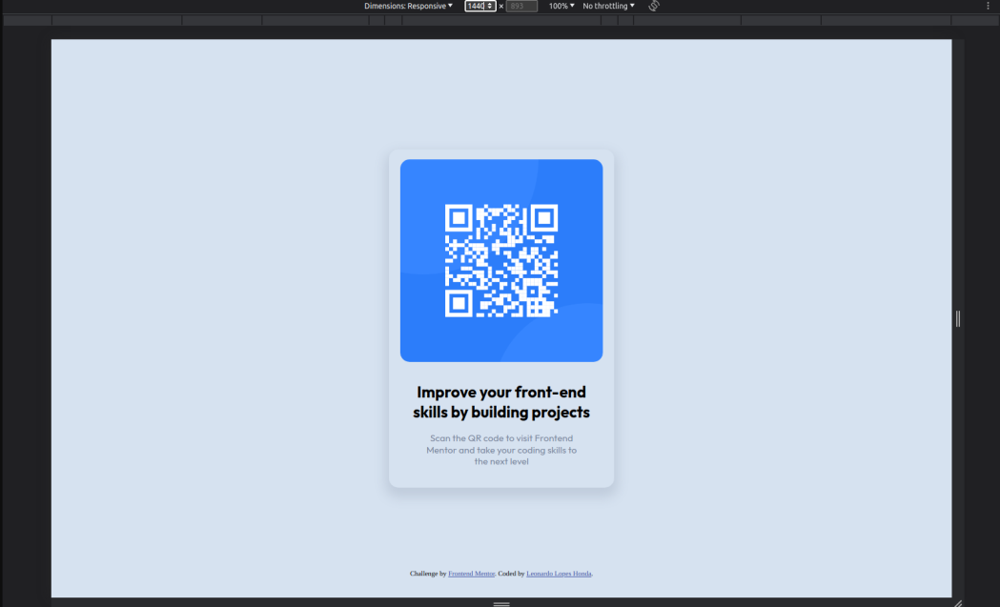
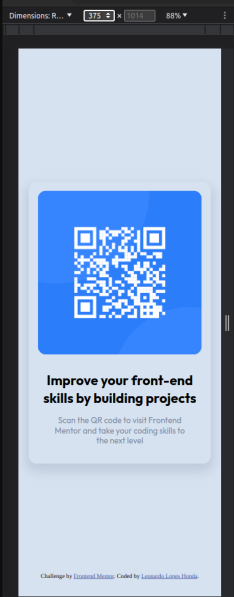

# Frontend Mentor - QR code component solution

This is a solution to the [QR code component challenge on Frontend Mentor](https://www.frontendmentor.io/challenges/qr-code-component-iux_sIO_H). Frontend Mentor challenges help you improve your coding skills by building realistic projects. 

## Table of contents

- [Overview](#overview)
  - [Screenshot](#screenshot)
  - [Links](#links)
- [My process](#my-process)
  - [Built with](#built-with)
  - [What I learned](#what-i-learned)
  - [Continued development](#continued-development)
  - [Useful resources](#useful-resources)
- [Author](#author)
- [Acknowledgments](#acknowledgments)

## Overview

### Screenshot




### Links

- Solution URL: [GitHub](https://github.com/LeonardoLopesHonda/QR-Code_component)
- Live Site URL: [Lieve-preview](https://leonardolopeshonda.github.io/QR-Code_component/)

## My process

I've started with HTML tags, then started adding the image url and adjusting the card and image sizes, then I started styling fonts, margins, padding and colors, then used semantic HTML to separate the card from the footer, then I created a breakpoint to the card width and finally I started editing the README.md.

### Built with

- Semantic HTML5 markup
- CSS custom properties
- Flexbox
- Desktop-first workflow

### What I learned

I've learned a little bit o the clamp() in css, because I tried to use on the card breakpoint but it didn't worked as expected, so I decided to use media queries instead.

```css

/* Using clamp() {as I said it didn't worked as I expected} */

.card {
    width: clamp(25%, 25%, 90%);
}

/* Using media queries */

.card {
    width: 25%;
}

@media (max-width: 375px) {
    .card {
        width: 90%;
    }
}
```

### Continued development

I want to refactor this project with a tailwindcss and master responsiveness layouts.

### Useful resources

- [Clamp()](https://developer.mozilla.org/en-US/docs/Web/CSS/clamp) - This helped me to understand how clamp() works
- [Box-shadow Generator](https://www.cssmatic.com/box-shadow) - This is an amazing website which helped me finally understand and create a good box-shadow. I'd recommend it to anyone still learning this concept, one reminder is try to change the properties in the code to test different results.

## Author

- Frontend Mentor - [@LeonardoLopesHonda](https://www.frontendmentor.io/profile/LeonardoLopesHonda)
- LinkedIn - [Leonardo Honda](https://www.linkedin.com/in/leonardo-honda-9a3383248/)